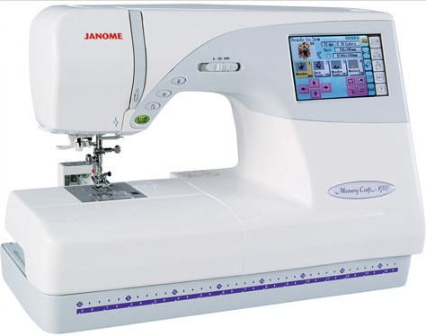

# Sewing & Emroidery (Janome MemoryCraft 9700)

## SAFETY INSTRUCTIONS :
- Always unplug this sewing machine from the electric outlet after using,before cleaning and before replacing or adjusting any parts.
- Do not allow children to play with the machine.
- Never operate the machine with any air opening blocked. Keep ventilation openings of this sewing
machine and foot controller free from accumulation of dust and loose cloth.
- Always use the proper needle plate. The wrong plate can cause the needle to break.
- Do not pull or push fabric while stitching. It may deflect the needle causing it to break.
- Do not use the machine while something is hanging from your  body, like a tie or necklace.

## Emdroidery sewing:
Machine embroidery is an embroidery process whereby a sewing machine or embroidery machine is used to create patterns on textiles. It is used commercially in product branding, corporate advertising, and uniform adornment. Hobbyists also machine embroider for personal sewing and craft projects.

## Before using the machine:
There are a few things that you need to know before using this machine, [here](https://www.youtube.com/watch?v=3HzTq1B65eQ) is a video that will help you with that.
